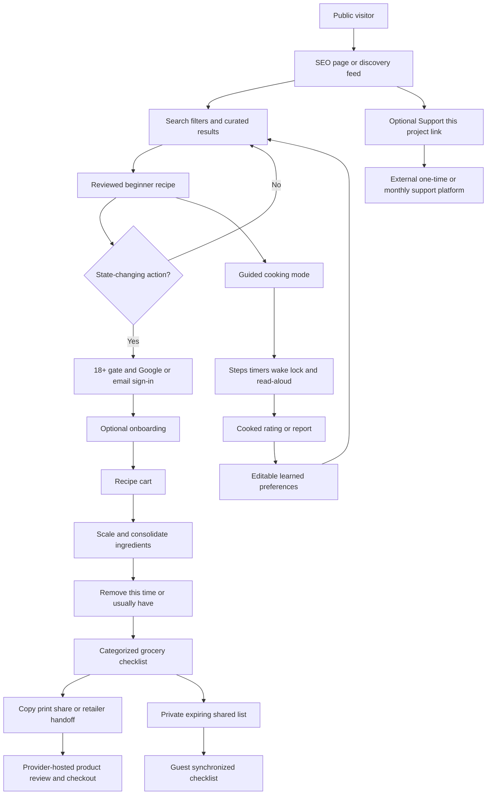

# Grocery Planner POC Specification

> [!warning] Working checkpoint
> This document records the decisions made through September 11, 2026. The design grill is paused, not complete. Items marked **Open** or **Follow-on** are not approved implementation requirements for the core build unless explicitly stated.

## Document control

| Field              | Decision                                                                                                      |
| ------------------ | ------------------------------------------------------------------------------------------------------------- |
| Working name       | Recipe Curator; final name pending                                                                            |
| Owner              | Josh                                                                                                          |
| Version            | 0.3 working draft                                                                                             |
| Updated            | September 11, 2026                                                                                            |
| Geography          | United States for the POC                                                                                     |
| Builder            | Josh, working alone                                                                                           |
| Available capacity | Variable by week                                                                                              |
| Operating ceiling  | Less than $100/month                                                                                          |
| Launch deadline    | No externally fixed date; milestone-based planning                                                            |
| Build status       | Frontend POC implemented as a React 19, TypeScript, and Vite static application; backend work has not started |

## 1. Product definition

Grocery Planner is a mobile-first recipe curator and grocery-shopping companion for newly independent young adults who lack cooking confidence or believe cooking is too difficult.

It is not primarily a meal planner. Its core experience is:

`discover food → select a reviewed recipe → add the recipe to a cart → consolidate groceries → remove owned items → shop → cook with guidance → provide feedback`

### Hypotheses

The product must determine whether:

1. Target users want an all-in-one recipe discovery and shopping experience and will return to it.
2. A selected recipe can become a practical grocery list and, through approved external providers, eventually reach store selection, cart, aisle, and checkout experiences.

Demand validation is the core POC objective. Retailer integrations must not block testing the core experience.

### Completion definitions

- **Build complete:** the core website is publicly deployed.
- **POC complete:** the recruited 14-day cohort has finished and evidence has been reviewed.
- The evidence review concludes with **Proceed**, **Revise and retest**, or **Stop**.

## 2. Scope priority

### Core build

- Public mobile-first website.
- Public recipe and curated collection pages.
- Visual discovery feed, search, and filters.
- Reviewed beginner recipes and guided cooking mode.
- Authentication and adaptive user profiles.
- Recipe cart and consolidated grocery checklist.
- Pantry defaults and cart sharing.
- Nutrition estimates.
- SEO, analytics, feedback, safety reporting, account export, and deletion.
- Optional external “Support this project” link.

### May follow the core POC

- Instacart shopping-list handoff.
- Exact store-product, price, and aisle integrations.
- Approved embedded retailer checkout.
- Native/PWA delivery and reliable background notifications.
- Admin dashboard.
- AI cooking chatbot.
- Reviewed AI-generated technique illustrations.
- Marketing and recommendation emails.
- Phone verification and SMS features.

If capacity or budget becomes restrictive, retailer integrations are deferred before the core discovery-to-list experience.

## 3. Audience and access

### Audience

The primary audience is young adults in their late teens or early twenties who recently moved out and need help choosing, shopping for, and preparing approachable food.

### Public access

Anyone may:

- View landing, recipe, and curated collection pages.
- Browse the default discovery feed.
- Search and filter recipes.
- Read complete recipe and cooking guidance.
- Report a factual or safety concern.

### Account access

Accounts are restricted to users aged 18 or older during the POC. Before authentication, a neutral month/year screen derives an `18_plus` result. The raw birth month/year is discarded; only the result, method/version, and timestamp are retained.

Authentication is required to:

- Save or rate recipes.
- Add recipes to a cart.
- Persist preferences and pantry defaults.
- Mark a recipe cooked or not interesting.
- Share an interactive list.
- Export or delete account data.

The application preserves an attempted anonymous action through sign-in.

### Authentication

- Initial methods: Google and passwordless email.
- Begin with Microsoft Entra External ID.
- Permit migration to Auth0 if Entra integration becomes a schedule blocker.
- Maintain an internal provider-neutral `User.Id` and external identity mappings.
- Never merge accounts solely because email addresses match.
- Microsoft, Apple, and possibly Facebook login are future options.

### Profile information

Stored profile fields may include:

- Verified email.
- Optional display name.
- Optional ZIP code.
- Optional phone number.
- Age-gate result.

The optional POC phone number is stored unverified and has no current feature use. It is not used for login, recovery, messaging, retailer transfer, AI, or analytics. It may be verified after the POC when a specific phone-dependent feature exists. It remains until the user edits or deletes the account.

## 4. Onboarding and personalization

Onboarding appears after account creation but may be skipped and completed later.

Before the first cart addition, the user must select allergens/dietary restrictions or explicitly choose “none known.” Other profile fields may remain incomplete.

### Required or explicitly acknowledged

- Allergies and dietary restrictions.
- Number of servings.

### Optional

- Available cooking equipment.
- Maximum cooking time.
- Budget preference.
- Disliked foods.
- Cuisines of interest.

### Learning signals

Strong signals:

- Added a recipe to the cart.
- Marked a recipe cooked.
- Liked or disliked a cooked recipe.
- Selected “not interested,” optionally with a reason.
- Repeated cuisine, ingredient, time, equipment, or difficulty choices.

Views are weak signals. Users can inspect, edit, reset, or remove inferred preferences and can ask, “Why am I seeing this?”

Recommendations use approximately 80% established preference matches and 20% controlled exploration. Exploratory results must be explainable and dismissible.

## 5. Discovery and recommendation behavior

### Interface

- Personalized visual feed.
- Keyword and natural-language search.
- Quick filters for time, cuisine, primary ingredient/protein, equipment, difficulty, dietary suitability, and allergens.
- Editorial collection pages such as beginner dinners under 30 minutes.

Anonymous visitors immediately see an editorial beginner feed. Optional session-only filters and preference prompts may improve it without requiring registration. Anonymous choices can be offered for transfer after sign-in.

### Recommendation engine

- Deterministic rules enforce hard constraints.
- Structured scoring ranks eligible recipes.
- AI may interpret natural-language intent and explain rankings.
- AI never overrides safety-related data.
- No constraint is silently relaxed.
- If no recipe matches, show an empty state and an “Edit filters” action.

If the AI provider is unavailable or over budget, deterministic search, filters, scoring, and all cart behavior continue. AI explanations and natural-language interpretation may be temporarily unavailable.

### AI data boundary

The AI provider may receive only:

- Current query.
- Non-identifying preference summaries.
- Metadata for recipes that already passed deterministic eligibility checks.

Never send names, email, phone, account IDs, pantry contents, raw event history, or analytics identifiers. Safety-authoritative facts remain in reviewed application data.

### Provider approach

Use a provider-neutral internal AI adapter backed initially by Azure OpenAI. Provider/model selection, quotas, caching, and model evaluation remain implementation decisions within the agreed safety and budget boundaries.

## 6. Recipe catalog and editorial workflow

### Launch catalog

The initial catalog contains approximately 40–60 beginner recipes, with room to grow. Target distribution:

- Approximately 60% dinner/main dishes.
- Approximately 20% lunch.
- Approximately 20% breakfast.
- Snacks and desserts follow later.

### Sources

The catalog may combine:

- Original recipes.
- Commissioned recipes.
- Properly licensed content.
- Independently written adaptations inspired by public recipes.
- Moderated user submissions later.

Public availability is not permission to copy expressive directions, commentary, or photography. Adapted content uses independently written instructions, owned/licensed images, and a visible inspiration-source link.

### Approval

Josh is the sole publication approver. A mandatory test cook is not required. Every recipe must pass the editorial and safety checklist; POC users can report errors and safety issues.

### Publishing

The POC uses a protected internal import command rather than an admin dashboard. It must:

1. Validate a versioned schema.
2. Validate required recipe, safety, allergen, nutrition, image, and provenance fields.
3. Preview changes.
4. Record approver and revision.
5. Publish approved data to Azure SQL.
6. Invalidate affected page caches immediately.
7. Create an audit record.

Approved recipe source files also live in Git for reviewable changes, provenance, rollback, and environment reconstruction. SQL stores the published runtime representation.

## 7. Food safety, allergens, and feedback

### Safety gate

Applicable recipes must include reviewed guidance for:

- Thermometer-based safe endpoint temperatures.
- Cross-contamination prevention.
- Safe thawing and raw-food handling.
- Raw egg and flour precautions.
- Leftover cooling, storage, and reheating.

The POC excludes sous-vide, raw or rare animal products, home canning, fermentation, and smoking until specialized standards and review exist.

AI cannot author or change authoritative temperature, allergen, storage, or doneness facts.

### Allergens

- Track the nine major FDA allergens and an explicit `unknown/unverified` state.
- Missing data never means safe.
- A recipe with unknown status may appear with a warning.
- Do not claim that the product or recipe is allergy-friendly until its relevant data is confirmed.
- Users must verify manufacturer labels, substitutions, and cross-contact risk.
- Gluten-free is a future separately validated filter and cannot be inferred from absence of wheat.

### Feedback and withdrawal

- Anyone may report factual errors or safety concerns without an account.
- Signed-in users may rate, mark cooked, and provide experience feedback.
- Serious reports involving safety, allergen, materially wrong quantity, or dangerous instruction temporarily withdraw the recipe.
- Josh receives an immediate alert and must reapprove the recipe before republication.
- Ordinary corrections target five business days.
- Aggregate public ratings appear only after at least five signed-in users mark the recipe cooked and rate it.

## 8. Nutrition estimates

Use USDA FoodData Central during the reviewed editorial/import workflow, not as a live page dependency.

For each mapped ingredient, retain the selected FDC record, preparation state, gram conversion, nutrient values, retrieval/version details, match confidence, reviewer, and calculation version.

Display estimated per-serving:

- Calories.
- Protein.
- Carbohydrates.
- Fat.

Store normalized amounts internally and round only final displayed values. Approved substitutions require separate mappings and recalculation.

If the combined estimate is incomplete, do not show a misleading total. Show “Nutrition estimate unavailable” and a breakdown identifying which ingredients are mapped and which remain unresolved.

Label results as estimates derived from USDA data. Do not present an FDA-style Nutrition Facts panel or make regulated nutrient claims.

## 9. Recipe measurements and substitutions

- Store canonical weights and volumes using grams/milliliters.
- US customary units are the default POC display.
- Users can switch to metric units, including grams.
- Serving quantities can be changed on the recipe page and in the cart.
- A cart serving change recalculates that recipe contribution and reruns consolidation.

During the POC, users see only reviewed substitutions with validated cooking behavior, allergen metadata, quantity conversion, and nutrition mapping.

At scale, AI may propose substitution candidates, but candidates require automated validation and human approval before becoming user-visible.

## 10. Guided cooking mode

The POC includes a structured assistant rather than an AI chatbot.

Features:

- Step-by-step instructions and progress.
- Relevant ingredient and equipment references.
- Multiple labeled timers.
- Start, pause, resume, add time, reset, and dismiss controls.
- Optional read-aloud.
- Optional “Keep screen awake while cooking.”
- No automatic step advancement.

Timers use absolute deadlines and reconcile overdue timers when the page becomes visible again. While visible, the page provides persistent visual state, accessible announcements, and optional user-enabled sound.

An ordinary website cannot guarantee alarms after the user backgrounds the page or locks the phone. Display a warning to set the device timer when leaving the cooking page. Reliable background notifications and a chatbot are follow-on capabilities.

## 11. Cart and pantry

Users add recipes, not products.

The cart must:

- Maintain one persistent active cart.
- Scale each recipe to selected servings.
- Combine matching ingredients only when identities and units are compatible.
- Keep ambiguous matches separate.
- Preserve recipe attribution.
- Allow quantity changes and removal.
- Group by grocery category/aisle by default.
- Offer a recipe-attribution view.
- Let users check off purchased items without hiding them permanently.
- Archive or clear manually.
- Prompt to archive after handoff or cooking activity rather than assuming checkout occurred.

### Pantry defaults

Users can choose:

- Remove this time.
- I usually have this.

Pantry defaults are reconfirmed after 30 days or on demand. An optional future assistant may infer likely consumption and ask for confirmation, but it never automatically changes pantry truth.

## 12. Sharing

- Copy, print, and native device sharing are included.
- Users may create a private, unguessable, revocable shared-list link.
- Shared links expire after 30 days.
- A recipient can view and check off items without an account.
- Checklist changes synchronize periodically across shoppers.
- Anonymous recipients appear only as “Guest.”
- Shared views expose groceries, selected store/aisle information when available, and checked state—not recipes, profiles, phone, preferences, or account data.

## 13. Store selection and retailer integration

### POC behavior

- ZIP entry is optional.
- A user may manually enter a ZIP using browser autofill.
- “Use my location” appears only after a deliberate action.
- Coordinates are reverse-geocoded to ZIP and immediately discarded.
- The user confirms before the ZIP is saved.
- Denial or failure never blocks the generic list.
- Show supported nearby retailer brands when the provider supplies them.
- If a store is unsupported, notify the user and fall back to the generic categorized checklist.

### Instacart

The credible supported boundary is:

`recipes → consolidated ingredients → Instacart-hosted list → retailer/product review → user-controlled checkout`

Grocery Planner does not place the order, reserve delivery, take grocery payment, or claim to own Instacart checkout.

### Future provider-neutral capabilities

Retailer connectors may progressively support:

- Nearby exact stores.
- Product matching.
- Live price and availability.
- Aisle/bay/shelf location.
- Cart transfer.
- Official embedded partner checkout.

No integration is Kroger-specific by design, and no universal availability is promised. Use only an official provider SDK/component; otherwise open provider-hosted checkout. Grocery Planner never takes grocery payment.

## 14. Cost display

Before store selection, show reviewed broad estimates using `$`, `$$`, or `$$$`:

- Estimated total for the default recipe yield.
- Estimated cost per serving.

When an approved retailer API returns current pricing, show it separately with store and retrieval time. Never present invented price estimates as current store prices.

## 15. SEO

Indexable:

- Individual public recipe pages.
- Original curated collection pages.
- Public marketing and explanatory pages.

Non-indexable:

- Personalized feeds.
- Accounts and profiles.
- Carts and shared-list management.
- Arbitrary searches/filter combinations.
- Support/payment management.

Requirements:

- Stable canonical URLs.
- Server-rendered public content.
- Recipe JSON-LD matching visible content.
- Unique titles and descriptions.
- Crawlable images/links.
- Sitemap.
- Correct 404 behavior.
- Google Search Console monitoring.

Final naming/domain selection occurs in a separate session before deliberate indexing begins.

## 16. Analytics and communication

### Analytics

Use Azure Application Insights for product events and application health, plus Google Search Console for SEO.

Anonymous activity is aggregate or pseudonymous. After sign-in, a pseudonymous internal identifier may connect events across sessions.

Track:

`landing → browse/search/filter → recipe view → sign-in → save/add → ingredient edits → grocery-list completion → return visit`

Track Instacart handoff separately after that integration launches. Additional events include recommendation acceptance/dismissal, cooked/rating feedback, report submission, and support-link clicks.

Do not send names, email, phone, ZIP, allergies, raw free-text searches, recipe content, shared-link tokens, or payment URLs into telemetry. Session replay is excluded.

### Cohort

Recruited users enter through a tagged link that assigns a pseudonymous cohort flag. The site remains open to organic users; cohort reporting remains separate.

### Email

- Transactional email supports authentication, security, deletion, and support.
- Store separate consent records for product updates, supporter updates, and future recipe recommendations.
- Marketing and recommendation emails are not sent during the core POC.
- Consent is explicit, versioned, timestamped, revocable, and never implied by authentication or payment.

## 17. External project support

The POC includes an outbound **Support this project** link that accepts real payment outside Grocery Planner.

### Offer

- Optional one-time support with supporter-selected amount.
- Optional recurring support initially set to $5/month.
- The amount may increase for new supporters later.
- Existing $5 supporters remain at $5 unless they voluntarily change.
- No promised product benefit, badge, access, equity, or tax deductibility.
- Support helps continued development and operating expenses.
- Avoid calling it a charitable donation or membership.

### Platform

Ko-fi and Buy Me a Coffee remain under evaluation. Before public launch, create test accounts and evaluate:

- Mobile checkout.
- One-time and recurring support.
- Cancellation.
- Receipts and billing descriptors.
- Seven-day refunds.
- Disputes.
- Payout/KYC setup.
- Terms and privacy behavior.

Choose one public support platform. Do not load a third-party widget site-wide.

### Data and refunds

- Grocery Planner records only the outbound-link click.
- Supporter identity, payment, recurring state, and cancellation remain with the external platform and Stripe/PayPal.
- Grocery Planner has no paid entitlements to synchronize.
- Offer a full refund requested within seven days of a one-time or recurring charge, subject to applicable rights and the selected platform’s operational flow.
- Cancellation stops future recurring charges.
- Josh remains responsible for the offer, refunds, disputes, tax reporting, and privacy disclosures even though the platform handles card data.

## 18. Proposed technical architecture

| Area                      | Decision                                                                                                        |
| ------------------------- | --------------------------------------------------------------------------------------------------------------- |
| Client                    | Mobile-first responsive React website; no native app or installable PWA in the core POC                         |
| Frontend framework        | React with TypeScript, built with Vite                                                                          |
| Current application shape | Frontend-only single-page application with reusable feature components and in-memory POC data                   |
| Frontend hosting          | Static frontend files hosted in Azure; select the exact Azure static-hosting service before deployment          |
| Backend                   | Deferred. A separately deployed Azure-hosted API may be added after the frontend POC validates the product flow |
| Database                  | Deferred with the backend. Azure SQL remains a candidate, not a current frontend dependency                     |
| Identity                  | Entra External ID first; Auth0 escape path                                                                      |
| AI                        | Provider-neutral adapter, initially Azure OpenAI                                                                |
| Analytics                 | Application Insights and Search Console                                                                         |
| Images                    | Optimized application assets and/or Azure Blob Storage as volume requires                                       |
| Payments                  | External Ko-fi or Buy Me a Coffee link; no card handling in Grocery Planner                                     |
| Grocery integration       | Provider-neutral adapters; Instacart handoff is first candidate                                                 |
| Source control            | Git                                                                                                             |
| Environments              | Local, one shared nonproduction environment, production                                                         |

### Modules

- `discovery`
- `catalog`
- `identity`
- `preferences`
- `recommendations`
- `nutrition`
- `cooking`
- `cart`
- `sharing`
- `integrations`
- `support`
- `analytics`

### Current frontend implementation boundary

The current implementation is a clean React 19 and TypeScript frontend built with Vite. It contains no Next.js runtime or generated `.next` artifacts. It must not include server routes, database access, identity-provider integration, secrets, or provider SDKs. POC data and mutations remain local or in browser storage behind simple frontend interfaces so a future Azure API can replace them without rewriting page components.

Implemented in the frontend POC:

- Responsive discovery, search, quick filters, a ten-recipe mock catalog, recipe details, and an editorial collection route.
- Dark mode by default with a persistent bright-mode option.
- A local age-check and authentication handoff screen with no identity-provider calls.
- Dietary acknowledgement, editable allergen preferences, deterministic allergen exclusions, and visible recipe allergen disclosures.
- Per-ingredient calories, per-serving calorie/protein/carbohydrate/fat estimates, meal/cart calorie totals, US/metric display, and serving-aware quantities.
- A persistent active grocery plan with compatible ingredient consolidation, recipe attribution, checked items, pantry defaults, serving changes, removal, and local archive/clear behavior.
- Guided cooking steps, multiple deadline-based timers, visibility reconciliation, read-aloud, optional wake lock, and explicit background-alarm limitations.
- Local saved recipes, cooked/rating feedback, factual/safety reports, support requests, preferences, data export/deletion, copy/print/native sharing, ZIP confirmation, generic retailer fallback, and a client-side 404 page.
- Automated tests for the primary frontend behaviors plus TypeScript and production-build verification.

Deferred because they require a backend, provider approval, infrastructure, or deployment configuration:

- Real authentication, accounts, cross-device persistence, server-side export/deletion, email, and retention enforcement.
- SQL-backed recipe publication/import, approval audit records, cache invalidation, and live USDA editorial mappings.
- Private synchronized and revocable share links with expiry and multi-shopper updates.
- Reverse geocoding, nearby retailer discovery, live product/price/availability data, and retailer-hosted cart handoff or checkout.
- Azure OpenAI recommendations, Application Insights, alerts, external support payments, and notification delivery.
- Server-rendered SEO, canonical metadata, Recipe JSON-LD, sitemap generation, and hosting-level 404 rewrites.

The Vite production output is suitable for static hosting, including Azure Static Web Apps or an equivalent static-file host. Azure hosting files should be added only when the target service and routing configuration are selected.

## 19. Cost controls

- Keep the frontend deployable as static files.
- Use the free or lowest-cost suitable Azure static-hosting tier during the frontend POC.
- Do not provision the API, SQL database, or identity infrastructure during the frontend-only milestone.
- Reassess App Service, Functions, Container Apps, and Azure SQL costs when the backend boundary is designed.
- Daily telemetry cap.
- AI request/token caps and caching.
- Forecast alerts at $50 and $80/month.
- At $80, disable nonessential AI features before exceeding $100.

The frontend-only POC should have negligible hosting cost. The broader $100/month ceiling applies once backend, identity, telemetry, database, and AI services are introduced. Cost estimates must be refreshed before those services are provisioned.

## 20. Data lifecycle, backup, and recovery

### Account lifecycle

- Self-service export includes profile, preferences, pantry defaults, saved recipes, carts, and feedback.
- Deletion disables the account immediately.
- A 14-day recovery window permits cancellation of deletion.
- After 14 days, remove identifiable application profile, cart, pantry, preference, and recommendation data.
- A user may request immediate purge for an urgent privacy/safety reason.
- Automatically delete inactive identifiable accounts after 12 months.
- Retain only de-identified aggregate analytics.

External support and retailer records remain with their providers. Required financial records are subject to provider and applicable legal retention.

### Retention

| Data                        | Retention                                                                   |
| --------------------------- | --------------------------------------------------------------------------- |
| Pseudonymous product events | 13 months, then delete event-level data and retain de-identified aggregates |
| Application diagnostics     | 30 days                                                                     |
| Security/admin audit events | 90 days                                                                     |
| Ordinary support tickets    | 12 months after closure                                                     |
| Safety incidents            | Longer only for an active investigation or legal requirement                |
| Shared links                | 30 days unless revoked earlier                                              |

### Backup

- Production uses the Azure SQL free-offer seven-day locally redundant backup.
- Nonproduction uses its free/local recovery option.
- No long-term retention initially.
- Accept that regional disaster recovery is unavailable in this configuration.
- Target no more than 24 hours of recoverable data loss and restoration within one business day for supported local recovery scenarios.
- Backups may retain deleted records until backup expiry; disclose this.
- If a backup is restored, reapply completed deletions from the deletion ledger.
- Versioned recipe source files in Git provide independent catalog recovery.

## 21. Security and privacy

Launch gates:

- HTTPS only.
- Delegated OAuth/OIDC authentication.
- Server-side authorization for every account resource.
- Secure cookie and CSRF controls.
- Request validation and parameterized database access.
- Rate limits for auth, reports, sharing, imports, and AI.
- No secrets or provider keys in the browser.
- Telemetry property allowlists and sensitive-data redaction.
- Dependency/vulnerability scanning.
- Backup/restore drill.
- Legal review of privacy, terms, age gate, food-safety claims, sharing, and external support disclosures.

## 22. Testing, accessibility, release, and support

### Automated testing

- Unit tests for safety filters, recommendation eligibility, serving calculations, conversions, consolidation, and retention rules.
- Later backend integration tests for SQL, authentication/authorization, imports, deletion, analytics contracts, and external adapter boundaries.
- End-to-end tests for browse → sign-in → onboarding → cart → grocery list → share/export.

### Accessibility/browser target

- Design and test toward WCAG 2.2 AA without claiming conformance before a full audit.
- Critical main-flow keyboard, contrast, reflow, touch, and screen-reader defects block launch.
- Use Baseline Widely Available web features.
- Test current Chrome/Android, Safari/iOS, Edge/Windows, and Firefox desktop.
- Accessibility is important but not the product’s primary value proposition.

### Release

- CI automatically deploys nonproduction.
- Production requires Josh’s approval after build, type, lint, test, migration, and smoke checks pass.
- Each release has a rollback path.

### Support

- In-app support form initially; dedicated support address after the domain is selected.
- Categories: account, recipe error, safety, privacy/deletion, external support payment, and general feedback.
- Published response target: two business days.
- Safety reports follow immediate-withdrawal handling.
- Josh is the technical support, alert, release, and incident owner.
- No 24/7 availability or uptime SLA is promised.

## 23. Demand validation

Recruit at least 20 target users through a tagged campaign link.

Success thresholds:

- At least 70% find and add an acceptable recipe without assistance.
- At least 50% build a usable grocery list.
- At least 40% voluntarily return within 14 days.
- At least 30% request continued access, join a launch list, or show concrete support interest.

Measure grocery-list completion separately from Instacart handoff. Interview praise is supporting evidence, not proof.

## 24. Milestones

1. Complete the product specification and select a working brand.
2. Establish Git, a Vite React and TypeScript frontend, CI, and static Azure nonproduction hosting.
3. Build a frontend-only vertical slice with approximately 10 mock recipes: discovery, recipe detail, recipe cart, serving calculations, ingredient consolidation, pantry removal, and guided cooking. Keep data in memory and backend boundaries replaceable.
4. Build complete discovery, account, profile, feedback, cooking, nutrition, SEO, analytics, sharing, and deletion flows.
5. Expand and approve the catalog to 40–60 recipes.
6. Complete security, accessibility, browser/mobile, backup, and release checks.
7. Deploy publicly — **build complete**.
8. Run the 14-day recruited cohort and review evidence — **POC complete**.
9. If the decision is Proceed, expand retailer integration, phone/SMS features, marketing, chatbot, admin tooling, and other follow-on capabilities.

## 25. Open gates and known risks

| Priority | Item                          | Status                                                                                                        |
| -------- | ----------------------------- | ------------------------------------------------------------------------------------------------------------- |
| Critical | Final product name and domain | Separate naming/domain session required before indexing                                                       |
| Critical | Support platform              | Ko-fi versus Buy Me a Coffee test required                                                                    |
| Critical | Legal review                  | Required before public accounts and support payments                                                          |
| Critical | Recipe production             | 40–60 recipes, sole approval, and no mandatory test cook create schedule/quality risk                         |
| High     | Phone collection              | POC stores optional unused personal data without verification or defined feature                              |
| High     | SQL cost                      | Free/auto-pause design can exceed budget if public/user traffic keeps SQL online                              |
| High     | Backup                        | Free local backup has no regional disaster recovery                                                           |
| High     | Identity                      | Entra implementation must prove Google/passwordless flow and anonymous-action continuation; Auth0 is fallback |
| High     | Retail APIs                   | Full product/aisle/order experience depends on approved provider capabilities not broadly available today     |
| High     | Cooking timers                | Background/lock-screen alarms cannot be guaranteed on an ordinary mobile website                              |
| High     | Allergy posture               | Unknown recipes may display warnings; no allergy-friendly guarantee may be made                               |
| Medium   | AI model                      | Exact model, quota, caching, evaluation, and failure metrics remain implementation choices                    |
| Medium   | Calendar forecast             | No fixed deadline; milestones control delivery                                                                |
| Medium   | Admin workflow                | Import command is initial solution; dashboard trigger remains undefined                                       |

## 26. Remaining grill frontier

1. Complete Ko-fi versus Buy Me a Coffee test and select one provider.
2. Run a separate product-naming/domain session.
3. Confirm public launch states and complete legal review.
4. After the frontend POC is reviewed, validate the future backend boundary, Entra, SQL auto-pause, representative recipe import, consolidation, cooking wake lock, and external support links through separate technical spikes.
5. Review the first vertical slice before expanding the catalog.
6. Confirm that no unvisited product/operational branches remain, then approve the specification for implementation.

## 27. System flow

